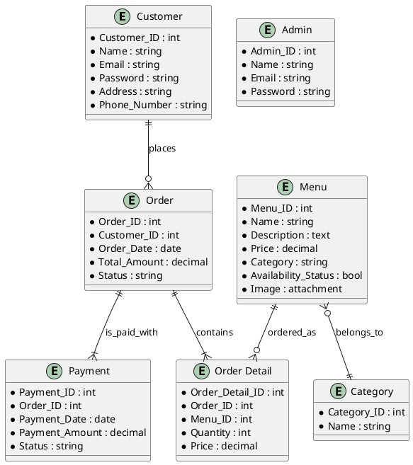

### Updated Proposal for Building an E-commerce Platform for Taste of Motherland

---

**Submitted by**: Samuel Oyedeji
**Date**: 2024-11-06
**Location**: Winnipeg, Manitoba, Canada

---

### Project Description

**Business Name**: Taste of Motherland

**Business Overview**:
Taste of Motherland is a prominent African restaurant in Winnipeg, Manitoba, known for its authentic and diverse African cuisine. Established in 2020, the restaurant has become a local favorite among the African community and residents seeking a genuine African culinary experience. With a team of 15 employees, Taste of Motherland offers a range of dishes representing various African cultures.

**Product Offering**:
The proposed e-commerce platform will feature an extensive menu of authentic African dishes, including main courses, appetizers, beverages, and desserts, along with packaged spices and sauces for customers to enjoy the restaurant’s unique flavors at home. This platform will support both ready-to-eat orders and specialty product sales.

**Current Sales Channels**:
Currently, Taste of Motherland offers dine-in and phone-based ordering. Although there is some social media presence, there is no existing e-commerce solution. This project will establish an online ordering system to facilitate takeout, delivery, and eventually, nationwide shipping for packaged items.

**Target Demographic**:
- **African immigrants** seeking familiar and traditional cuisine.
- **Food enthusiasts** interested in exploring authentic African dishes.
- **Local customers in Winnipeg** who appreciate diverse food offerings.

---

### Database Structure Description

The database will support user account management for both **customers** and **admin users**. Admins will have access to an admin dashboard for managing menu items, categories, and content on the website. The database will also handle customer orders, payments, and the catalog of available menu items.

#### 1. **Customer Table**
   - **Customer_ID** (int): Unique identifier for each customer.
   - **Name** (string): Customer’s name.
   - **Email** (string): Contact email for login and notifications.
   - **Password** (string): Encrypted password for secure access.
   - **Address** (string): Delivery address.
   - **Phone_Number** (string): Contact number.

#### 2. **Admin Table**
   - **Admin_ID** (int): Unique identifier for each admin user.
   - **Name** (string): Admin’s name.
   - **Email** (string): Contact email for login.
   - **Password** (string): Encrypted password for secure access.

#### 3. **Menu Table**
   - **Menu_ID** (int): Unique identifier for each menu item.
   - **Name** (string): Name of the dish or product.
   - **Description** (text): Details about the item, ingredients, or preparation.
   - **Price** (decimal): Cost per item.
   - **Category** (string): Type (e.g., appetizer, main course, dessert).
   - **Availability_Status** (bool): Indicates if the item is currently available.
   - **Image** (attachment): High-quality image of the menu item.

#### 4. **Categories Table**
   - **Category_ID** (int): Unique identifier for each category.
   - **Name** (string): Category name.

#### 5. **Orders Table**
   - **Order_ID** (int): Unique identifier for each order.
   - **Customer_ID** (int): Links to the customer placing the order.
   - **Order_Date** (date): Date of the order.
   - **Total_Amount** (decimal): Total cost of the order.
   - **Status** (string): Current order status (e.g., pending, completed).

#### 6. **Order Details Table**
   - **Order_Detail_ID** (int): Unique identifier for each item within an order.
   - **Order_ID** (int): Links to the specific order.
   - **Menu_ID** (int): Links to the menu item ordered.
   - **Quantity** (int): Quantity of each item in the order.
   - **Price** (decimal): Price per item at the time of the order.

#### 7. **Payments Table**
   - **Payment_ID** (int): Unique identifier for each payment.
   - **Order_ID** (int): Links to the order being paid.
   - **Payment_Date** (date): Date of the transaction.
   - **Payment_Amount** (decimal): Total payment amount.
   - **Status** (string): Payment status (e.g., completed, pending).

---

### Updated Entity-Relationship Diagram (ERD)

The ERD now includes both `Admin` and `Customer` models, reflecting the need for separate authentication and authorization levels for customers and admin users.

This ERD reflects the updated structure, including separate `Admin` and `Customer` tables to accommodate user roles. Let me know if you need further adjustments or explanations!
